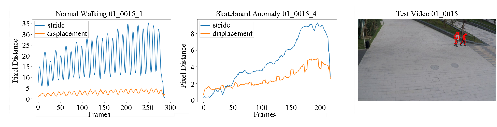

# Kinematics-VAD

## Human Kinematics-inspired Skeleton-based Video Anomaly Detection
The manuscript can be obtained from [here]().

The paper is currently undergoing revisions, and after acceptance, we will make all the code publicly available.

**Highlight:** In this paper, we conduct an exploratory study and introduce a new idea called HKVAD (Human Kinematic-inspired Video Anomaly Detection) for video anomaly detection, which involves the explicit use of human kinematic features to detect anomalies.

The upcoming modeling approach will be completely different from the modeling approach outlined in the manuscript.

